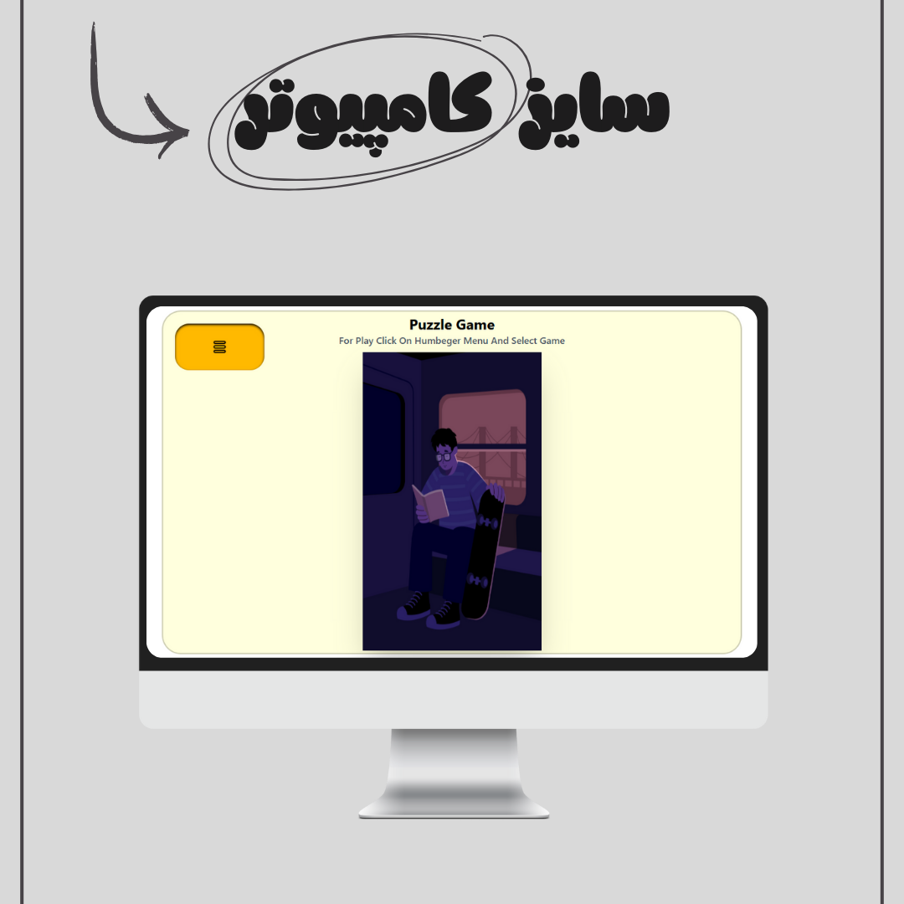
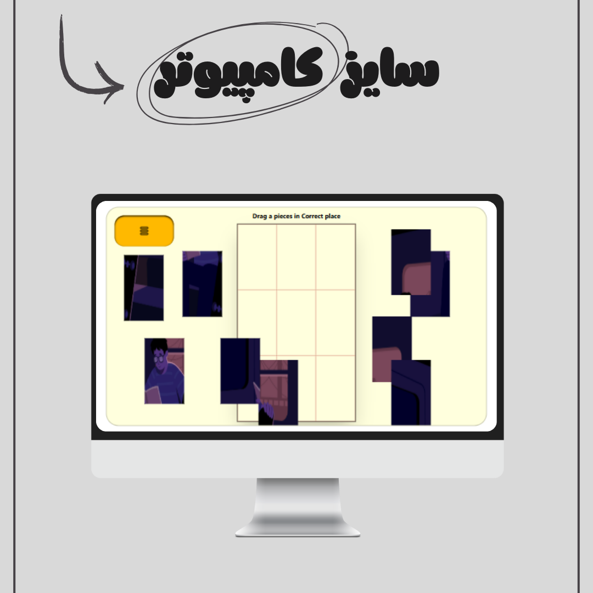
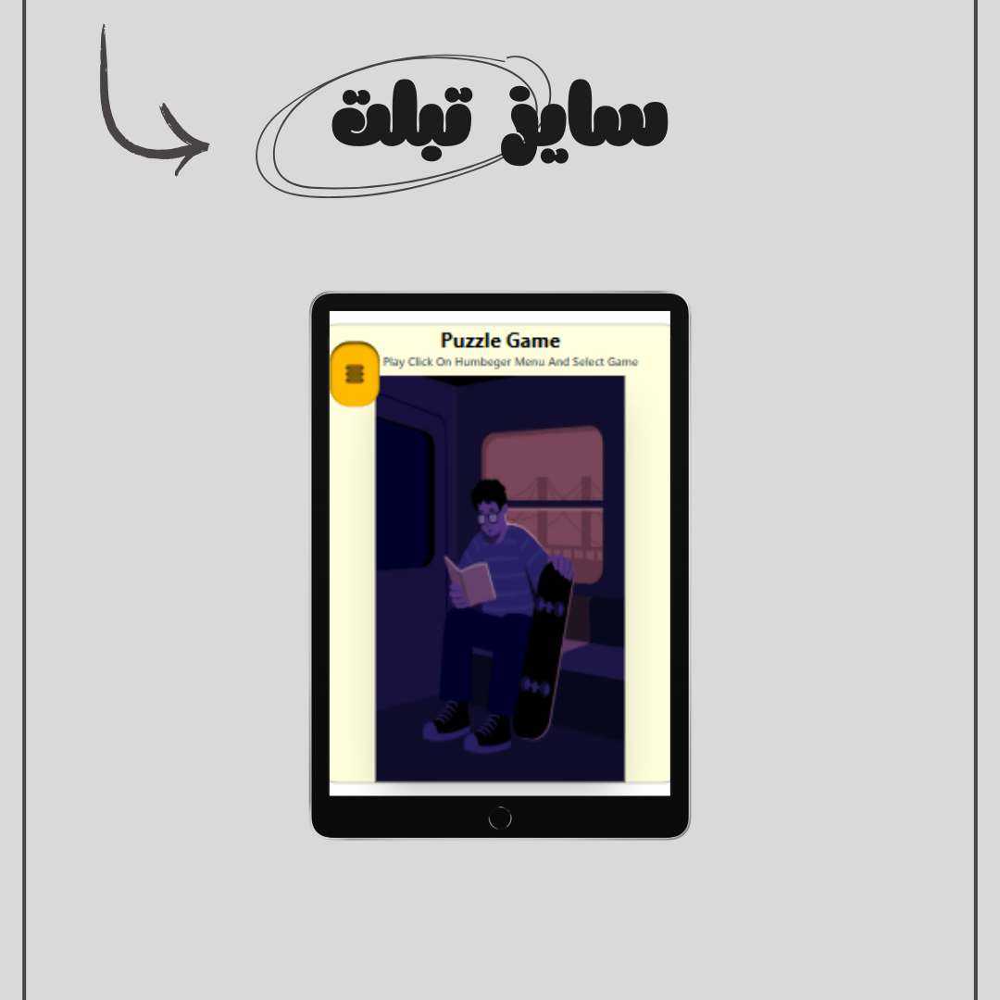
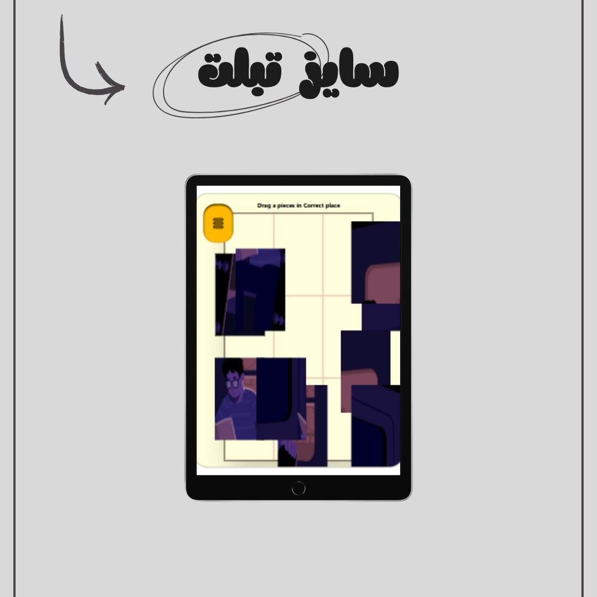
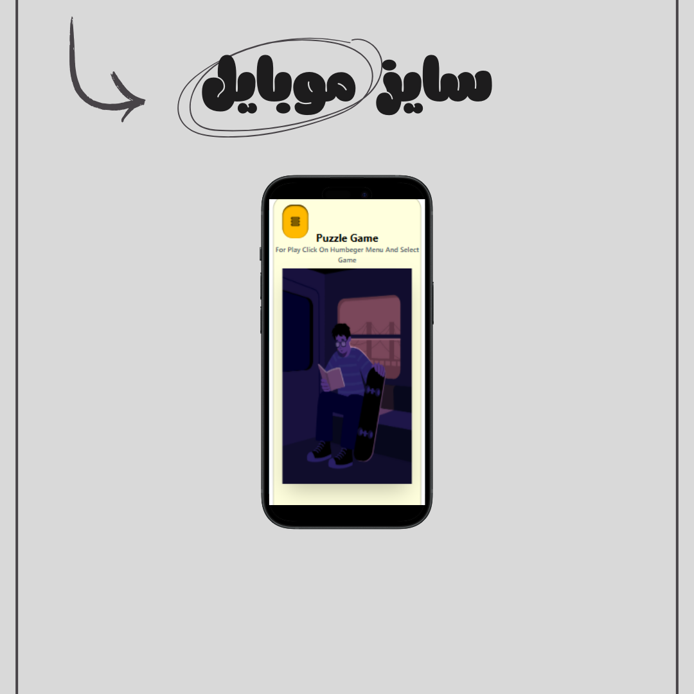
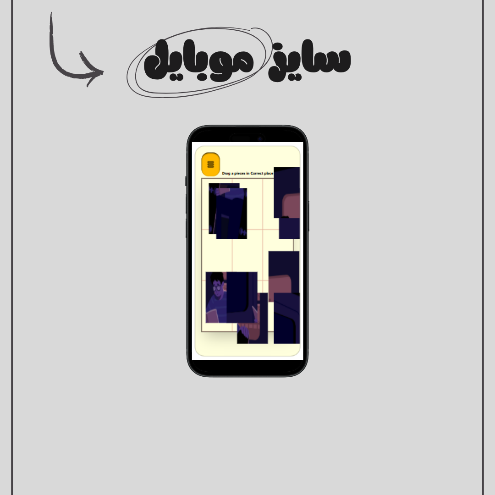

# 🧩 Puzzle Game – Interactive Image Puzzle (HTML, CSS, Tailwind, JS)

A fun and interactive **image puzzle game** built with **HTML5, CSS3, Tailwind CSS, and Vanilla JavaScript**.  
Drag and drop the puzzle pieces to their correct positions. When all pieces are correctly placed, an alert pops up saying **"You Win!"** 🎉

This project is fully **responsive** and works seamlessly on desktop, tablet, and mobile devices.

---

## ✨ Features
- 🖼️ Drag & drop image puzzle pieces
- ✅ Checks correctness of each piece
- 🎉 Shows alert "You Win!" when puzzle is complete
- 📱 Fully responsive design using Tailwind CSS
- 🧩 Clean and maintainable code with Vanilla JS

---

## 📅 Project Date
**September 23, 2025 | ۲ مهر ۱۴۰۴**

---

## 🔗 Live Demo
👉 [Try the Puzzle Game](https://parsa-farshah.github.io/puzzleGame/src/pages/mySocial.html)

---

## 👨‍💻 Developed By
**Parsa Dehghan Pour Farashah**

## 🔧 Project Mentor
[@parsa_ghorbanian_web](https://www.instagram.com/parsa_ghorbanian_web)

---

## 📲 Connect with Me
- 📸 Instagram: [@parsa_dehghanpour_dv](https://www.instagram.com/parsa_dehghanpour_dv?igsh=eHkwNWhsa3I4ZWVp)  
- 💼 LinkedIn: [Parsa Dehghan Pour Farashah](http://linkedin.com/in/parsa-dehghan-pour-farashah-85ab04250)  
- 💻 GitHub: [parsa-farshah](http://github.com/parsa-farshah)  
- 📩 Email: parsafarashah2002@gmail.com  
- 📺 YouTube: [@FrontEndFresh](https://youtube.com/@frontendfresh?si=-2WsIYe-KBTUfwyu)  
- 💡 CodePen: [@parsa-dehghan](https://codepen.io/parsa-dehghan)

---

## 📸 Project Screenshots

### 🌟 Overview

### 💻 Desktop View

### 💻 Desktop View

### 📱 Tablet View

### 📱 Tablet View

### 📱 Mobile View

### 📱 Mobile View

